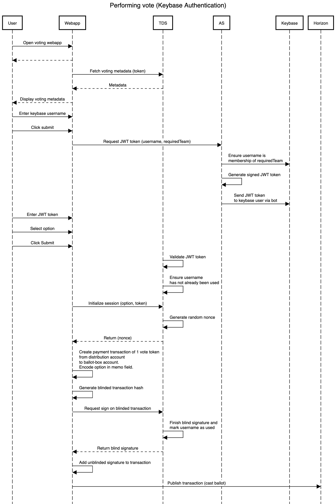

# Sequence diagrams
Those diagrams explain the sequence of voting creation, casting ballot, and counting results, using different authentication methods.

## Keybase authentication

### Voting creation

### Casting ballot

*NOTE: batching and cut-and-choose methods were skipped for simplicity. Blind-signature algorithm was simplified*

### Counting results

## One-time authorization codes

### Voting creation

### Casting ballot

*NOTE: batching and cut-and-choose methods were skipped for simplicity. Blind-signature algorithm was simplified*

### Counting results

